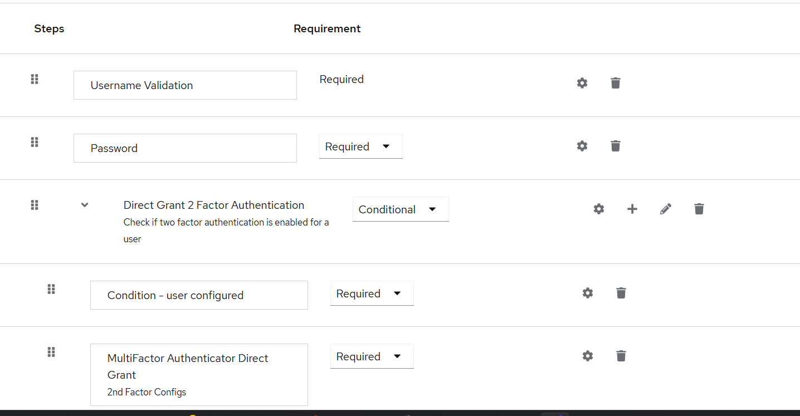
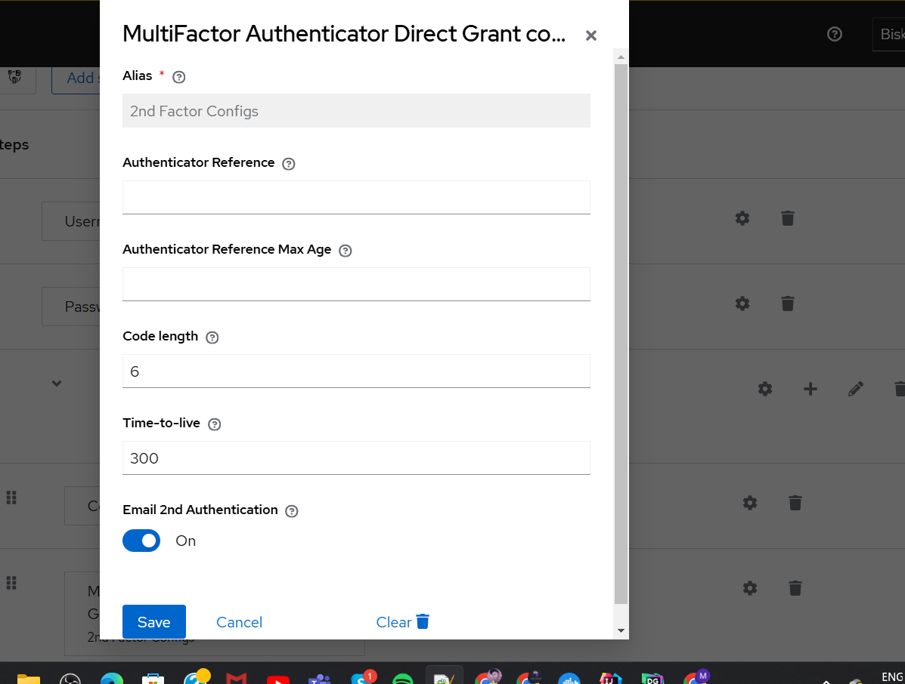
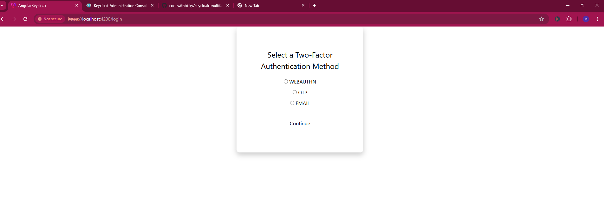
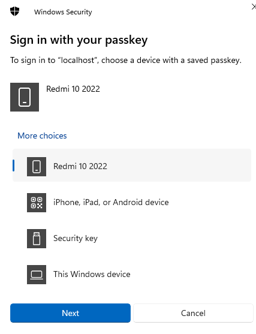

# Keycloak Multi-Factor Authentication Extension REST API

The **Keycloak Multi-Factor Authentication Extension** provides seamless integration for enabling 2FA (Two-Factor Authentication) in Keycloak. This extension supports multiple 2FA methods including Email, OTP, and WebAuthn, making your Keycloak-based authentication more secure.

## Problem Statement

A common challenge faced by developers when implementing WebAuthn Passkey with Keycloak is the reliance on Keycloak's default frontend for user authentication. Many teams prefer to maintain a custom frontend to align with their application's UI/UX.

A frequently asked question is:

> *How can I integrate Keycloak WebAuthn Passkey authentication using my own frontend and REST API, bypassing Keycloak's built-in frontend?*

This issue has been discussed in various forums, with developers seeking ways to handle WebAuthn registration and authentication without redirecting users to Keycloak's UI.

### Context
Keycloak version: **26.0.7**

Typical use case:
- Developers already have a custom username and password flow working via Keycloak's API and frontend.
- They seek to extend this setup to support WebAuthn Passkey registration and authentication through REST APIs.

---

## Solution: Use the Custom Keycloak Extension

We’ve developed a **custom Keycloak extension** that solves this problem by enabling WebAuthn Passkey registration and authentication via Keycloak’s REST APIs. This allows you to:

- Maintain your own frontend for user interactions.
- Register and authenticate users' devices using WebAuthn without redirecting to Keycloak’s frontend.
- Seamlessly integrate with existing Keycloak API-based workflows.

### Features of the Solution
1. **WebAuthn Registration API**:
   - Accepts client data from your frontend.
   - Handles WebAuthn key generation and storage in Keycloak.

2. **WebAuthn Authentication API**:
   - Validates the passkey against stored credentials in Keycloak.
   - Issues tokens for authenticated sessions.

3. **Customizable UI**:
   - Your frontend has full control over the registration and authentication flow.

---


## Features
- Supports 2FA via **Email**, **OTP**, and **WebAuthn**.
- Easily configurable through Keycloak Authentication Flows.
- REST API for interaction with 2FA features.
- Angular integration example available for WebAuthn.

---

## Requirements
- Keycloak instance running with HTTPS (mandatory for WebAuthn).
- Add the extension JAR: `keycloak-multi-factor-authentication-extension-rest-api.jar` to your Keycloak project.
- Get the latest JAR from our Discord: [Join Discord](https://discord.gg/5QEp5xK8Hw).

---

## Setup Instructions
### 1. Add the Extension to Keycloak
1. Download the JAR from the [Discord Channel](https://discord.gg/5QEp5xK8Hw).
2. Copy the JAR file to the `standalone/deployments` directory of your Keycloak server.
3. Restart the Keycloak server to load the extension.

### 2. Configure 2FA in Keycloak
1. **Login to Keycloak Admin Console**:
    - Navigate to your desired realm.
    - Open the **Authentication** menu.
2. **Duplicate and Configure Direct Grant Flow**:
    - Duplicate the `direct-grant` flow.
    - Rename it (e.g., `multiple-factor-direct-grant`).
    - Bind the new flow as `Grant Flow Type`.
    - Select your new flow and:
        - Remove the OTP step.
        - Add a new step: `MultiFactor Authentication Direct Grant`.
        - Set the requirement to `Required`.
    - Configure the new step:
        - Enable `Email 2nd Authentication` to enhance security.
        - Save changes.

---


Multi-Factor Configurations

## REST API Endpoints

### Retrieve Supported 2FA Methods
- **URL**: `/realms/<realm>/two-factor-auth/methods?username=<username>`
- **Method**: GET
- **Response**:
  ```json
  ["webauthn", "otp", "email"]
  ```
  If the response is empty, no 2FA is required. Otherwise, proceed with the selected method.

---

### Email Authentication
#### Send Verification Code
- **URL**: `/realms/<realm>/two-factor-auth/send`
- **Method**: POST
- **Parameters**:
    - `username`: User's username
    - `2nd_factor_type`: email
- **Response**:
  ```json
  {
    "reference": "8b5faa26-3dd8-43b3-abc9-71eb643d046d",
    "two_factor_type": "email"
  }
  ```
#### Complete Login with Email
- **URL**: `/realms/<realm>/protocol/openid-connect/token`
- **Parameters**:
  ```text
  client_id=<clientId>&password=<password>&username=<username>&grant_type=password&reference=8b5faa26-3dd8-43b3-abc9-71eb643d046d&verification_code=548065&2nd_factor_type=email
  ```

---

### OTP Authentication
- **URL**: `/realms/<realm>/protocol/openid-connect/token`
- **Method**: POST
- **Parameters**:
  ```text
  client_id=<clientId>&password=<password>&username=<username>&grant_type=password&2nd_factor_type=otp&otp=340142
  ```

---

### WebAuthn Authentication
#### Environment Configuration
Add the following environment variable to your server:
```text
KC_WEBAUTHN_DOMAIN=your-domain.com
```

#### Registration
1. **Start Registration**
    - **URL**: `/realms/<realm>/two-factor-auth/webauth/<userId>/register/start`
    - **Method**: POST
    - **Body**:
      ```json
      {
        "fullName": "John Doe",
        "email": "johndoe@example.com"
      }
      ```
    - **Response**:
      ```json
      {
        "reference": "fea6cc6d-7c1c-4734-aced-488a8523fdcc",
        "credentialCreationOptions": {
          "rp": { "name": "CodeWithBisky", "id": "localhost" },
          "user": { "name": "johndoe@example.com", "displayName": "John Doe", "id": "aAtceuoTSaiFooIjgpkQMw" },
          "challenge": "z25VzTcgLnPGKB4vTOgylQPDkpdXg3tadRHmXfc06Hs",
          "pubKeyCredParams": [{ "alg": -7, "type": "public-key" }],
          "timeout": 30000,
          "authenticatorSelection": { "userVerification": "discouraged" }
        }
      }
      ```

2. **Complete Registration**
    - **URL**: `/realms/<realm>/two-factor-auth/webauth/<userId>/register/finish`
    - **Method**: POST
    - **Body**:
      ```json
      {
        "reference": "fea6cc6d-7c1c-4734-aced-488a8523fdcc",
        "credential": "<credentialDataFromFrontend>"
      }
      ```

#### Login
1. **Start Login**
    - **URL**: `/realms/<realm>/two-factor-auth/webauth/login/start`
    - **Method**: POST
    - **Body**:
      ```json
      { "username": "johndoe@example.com" }
      ```

2. **Complete Login**
    - **URL**: `/realms/<realm>/protocol/openid-connect/token`
    - **Method**: POST
    - **Body**:
      ```json
      {
        "client_id": "<clientId>",
        "password": "<password>",
        "username": "johndoe@example.com",
        "grant_type": "password",
        "credential": "<credentialDataFromFrontend>"
      }
      ```

---

## Additional Resources
- **Angular WebAuthn Integration**: [GitLab Repository](https://gitlab.com/code-with-bisky/spring-boot/fido/angular-app.git)
- **Keycloak Docker Compose**: [GitLab Repository](https://gitlab.com/code-with-bisky/devops/keycloak.git) (branch: `feature/passkeys`)
- **Discord Channel**: [CodeWithBisky Discord](https://discord.gg/5QEp5xK8Hw) for updates.
- **Youtube Channel**: [CodeWithBisky Youtube_Channel](https://www.youtube.com/@CodeWithBisky) for latest tutorials.
- **Website**: [CodeWithBisky Website](https://codewithbisky.com) for latest tutorials

---

## Notes
- **HTTPS is mandatory** for WebAuthn to function.
- All latest changes and API updates are announced on the [CodeWithBisky Discord Channel](https://discord.gg/5QEp5xK8Hw).

## Angular Demo

## Choose Passkeys

